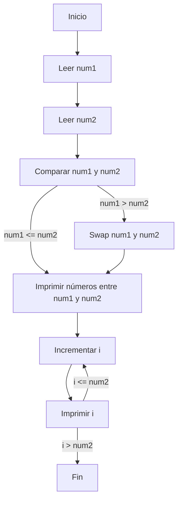

```mermaid
graph TB
A[Inicio] --> B[Leer num1]
B --> C[Leer num2]
C --> D[Comparar num1 y num2]
D -- num1 > num2 --> E[Swap num1 y num2]
D -- num1 <= num2 --> F[Imprimir números entre num1 y num2]
E --> F
F --> G[Incrementar i]
G --> H[Imprimir i]
H -- i <= num2 --> G
H -- i > num2 --> I[Fin]

```