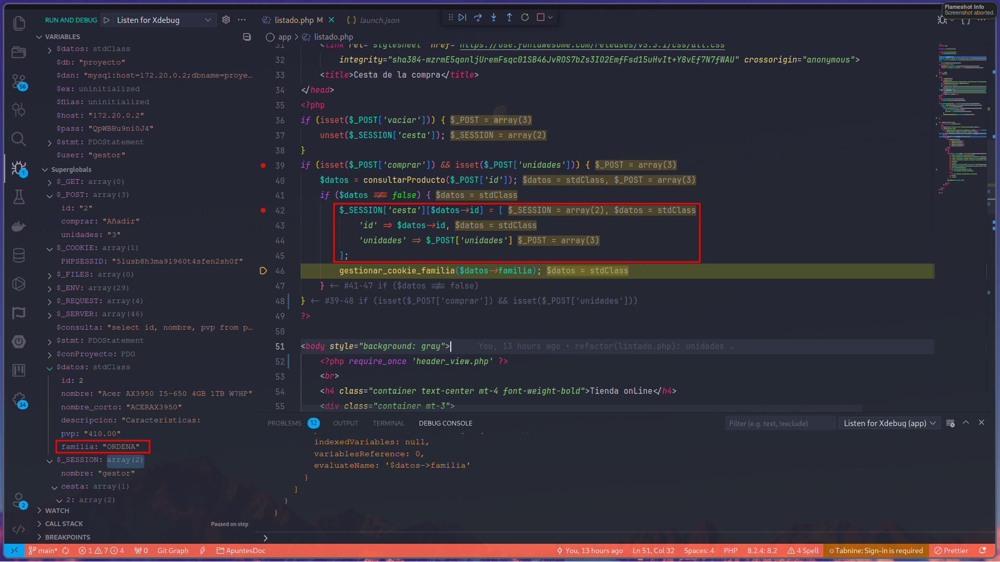
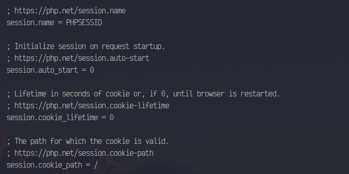
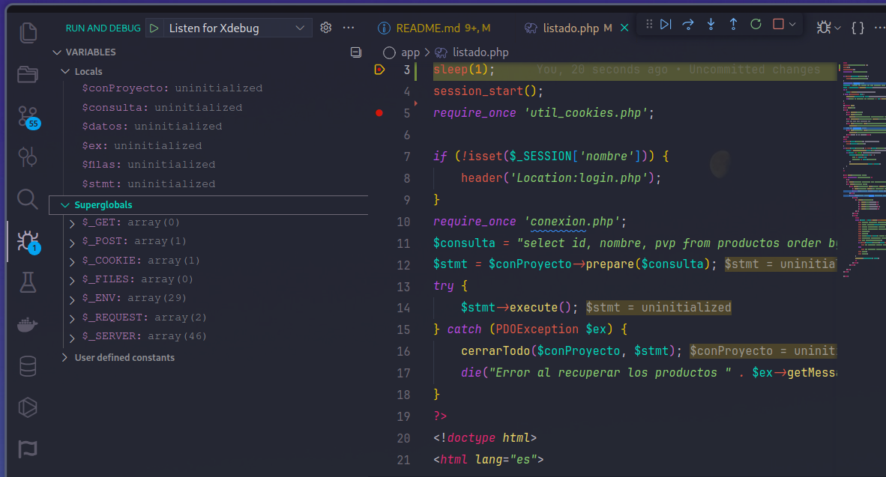
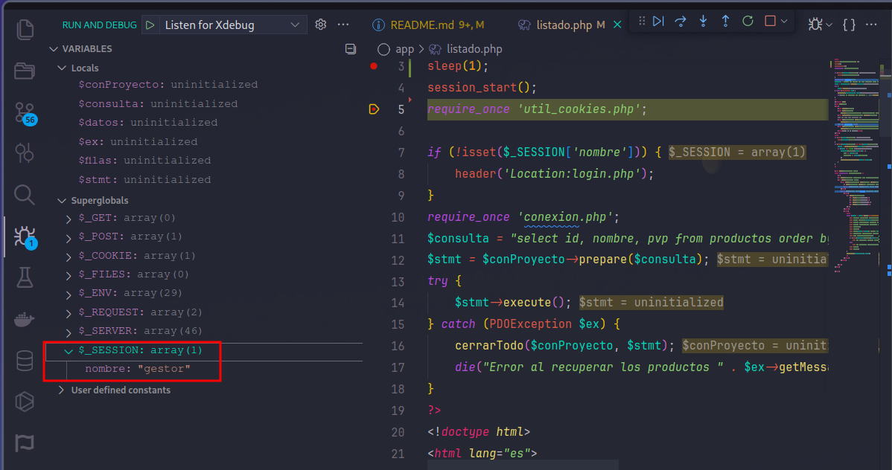

## 5- Asegúrate de que tienes bien configurado XDebug y que eres capaz de realizar depuración en tu código.

#### la línea de código que se acaba de ejecutar (señálala expresamente o indica en un texto de qué línea se trata)

#### el valor de la variable que contenga el código de familia que se acaba de añadir

#### el contenido del array superglobal $_COOKIE. Explica en la propia imagen por qué no está presente el código de familia que se acaba de añadir a la cookie

## 6- Sitúa puntos de ruptura en la instrucción session_start(). Muestra en sendas capturas:

#### a) valor de la directiva `session.auto_start`

#### b) antes de ejecutarse `session_start()`, ¿existe `$_SESSION`? ¿Por qué?

Al tener `session.auto_start=0` no se inicia al ejecutar el script, por lo tanto la superglobal `$_SESSION` se inicializa cuando se ejecute ` session_start()`.
#### c) justo después de ejecutarse `session_start()` ¿existe `$_SESSION`?¿Está vacía?¿Por qué?

Después de ejecutarse `session_start()`, se espera que `$_SESSION` exista.